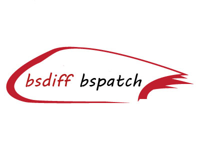

# bsdiff-cross-platform
bsdiff and bspatch which generates binary diff file in server and binary patch file in client

## DiffBinary

* DiffHelper.startDiffByCmd(String oldApkPath, String newApkPath, String patchPath) that bsdiff by commond in server

* DiffHelper.startDiff(String oldApkPath, String newApkPath, String patchPath) that bsdiff by JNI invoke in server,which will load dynamic link library.

* java -jar diffbinary2.jar oldApkPath newApkPath patchPath by commond in server

## PatchBinary

[PatchBinary](./PatchBinary):  PatchUtil.getInstance().applyPatch(oldApkPath, newApkPath, patchPath, targetMd5Hex) that generates new APK and make sure new APK 
MD5 equals targetMd5Hex

## bsdiff-win64-dll

[bsdiff-win64-dll](./bsdiff-win64-dll):  bsdiff win64 source code which can generate bsdiff-win64-dll.dll run on windows x64

## bsdiff

[bsdiff](./bsdiff):  bsdiff win64 source code which can generate bsdiff.exe on windows x64

## bspatch-win64-dll
[bspatch-win64-dll](./bspatch-win64-dll):  bspatch win64 source code which can generate bspatch-win64-dll.dll on windows x64

## bspatch
[bspatch](./bspatch):  bspatch win64 source code which can generate bspatch.exe on windows x64

## Linux
[Linux](./Linux):  bsdiff bspatch executable file on Linux

## Mac
[Mac](./Mac):  bsdiff bspatch executable file on mac os 

## Documentation

- [Binary diff/patch utility](http://www.daemonology.net/bsdiff)
